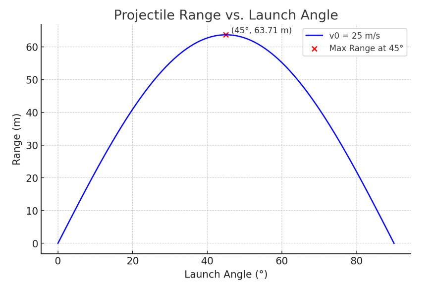

# Problem 1

Investigating the Range as a Function of the Angle of Projection

## 1. Theoretical Foundation

### Governing Equations of Motion

We begin by considering the motion of a projectile launched with an initial velocity $v_0$ at an angle $\theta$ with respect to the horizontal. Assuming no air resistance and a constant gravitational acceleration $g$ acting downwards, we can decompose the motion into horizontal and vertical components.

#### Equations of Motion:

- Horizontal motion:
  $$
  x(t) = v_0 \cos(\theta) t
  $$
- Vertical motion:
  $$
  y(t) = v_0 \sin(\theta) t - \frac{1}{2} g t^2
  $$

where:

- $x(t)$ and $y(t)$ are the horizontal and vertical positions at time $t$, respectively.
- $v_0$ is the initial velocity,
- $\theta$ is the launch angle,
- $g$ is the acceleration due to gravity.

### Time of Flight and Range

To find the time of flight, we set $y(t) = 0$ and solve for $t$:

$$
0 = v_0 \sin(\theta) t - \frac{1}{2} g t^2
$$

Solving for $t$, we get two solutions: $t = 0$ (the initial launch time) and $t = \frac{2 v_0 \sin(\theta)}{g}$. The latter is the total time of flight, $t_f$:

$$
t_f = \frac{2 v_0 \sin(\theta)}{g}
$$

The horizontal range $R$ is the horizontal distance traveled during this time, so we substitute $t_f$ into the equation for $x(t)$:

$$
R = v_0 \cos(\theta) t_f = v_0 \cos(\theta) \frac{2 v_0 \sin(\theta)}{g}
$$

Using the trigonometric identity $\sin(2\theta) = 2 \sin(\theta) \cos(\theta)$, we get the range formula:

$$
R = \frac{v_0^2 \sin(2\theta)}{g}
$$

This equation shows that the range is maximized when $\sin(2\theta) = 1$, which occurs when $2\theta = 90^\circ$, or $\theta = 45^\circ$.

---

## 2. Analysis of the Range

### Influence of Initial Conditions

- **Initial velocity ($v_0$)**: The range is proportional to the square of the initial velocity. Increasing $v_0$ significantly increases the range.
- **Gravitational acceleration ($g$)**: The range is inversely proportional to the gravitational acceleration. Higher $g$ reduces the range.
- **Launch angle ($\theta$)**: The range is maximized at $\theta = 45^\circ$, and it is symmetric around this angle.

### Graphical Representation

Below is a Python script to visualize how the range changes with $\theta$:

```python
import numpy as np
import matplotlib.pyplot as plt

def range_function(theta, v0, g=9.81):
    return (v0**2 * np.sin(2 * np.radians(theta))) / g

# Parameters
v0 = 25  # initial velocity in m/s
theta = np.linspace(0, 90, 100)  # range of angles in degrees
g = 9.81  # gravity in m/s^2

# Compute ranges
ranges = range_function(theta, v0, g)

# Plot results
plt.figure(figsize=(8, 5))
plt.plot(theta, ranges, label=f'v0 = {v0} m/s')
plt.xlabel('Launch Angle (degrees)')
plt.ylabel('Range (m)')
plt.title('Projectile Range vs. Launch Angle')
plt.legend()
plt.grid(True)
plt.show()
```



---

## 3. Real-World Implementations

-   **Athletics**: Projectile motion principles aid in refining release angles for disciplines such as archery, shot put, and football.
-   **Technical Design**: Employed in weaponry, defense technologies, and formulating flight paths for spacecraft and guided munitions.
-   **Cosmic Studies**: Utilized to simulate the courses of heavenly bodies and interplanetary expeditions.

## 4. Implementation

A computational simulation can provide a more in-depth analysis of scenarios involving air resistance. Incorporating drag force necessitates the use of numerical solution techniques (e.g., Runge-Kutta) for solving the resulting differential equations.

### Illustration: Incorporating Air Friction

The dynamic equations considering drag $F_d = -k v^2$ yield:

$$m \frac{d^2 x}{dt^2} = -k v_x^2$$
$$m \frac{d^2 y}{dt^2} = -mg - k v_y^2$$

A numerical computation tool, such as Python's SciPy library, can be utilized to determine the solutions.

---

## 5. Limitations and Further Considerations

-   **Atmospheric drag**: Results in asymmetry and shortens the projectile's reach.
-   **Irregular ground**: Demands solutions for intricate boundary conditions.
-   **Wind influence**: Alters the trajectory in unpredictable ways.

Future explorations might involve integrating machine learning methods to forecast projectile paths within complex environments.

---

## Conclusion

The dynamics of projectile motion offer profound mathematical and physical insights. While the simplified model serves as a decent approximation, practical implementations necessitate numerical approaches to address non-ideal scenarios.