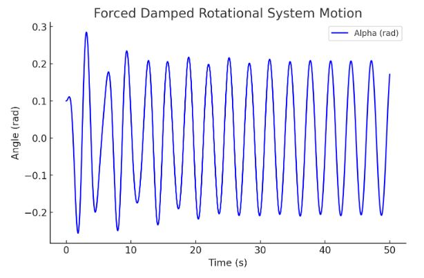

# Problem 2

Investigating the Dynamics of a Forced Damped Rotational System

## 1. Theoretical Foundation

### Governing Equation
The motion of a forced damped rotational system is governed by the nonlinear differential equation:

$$
I \frac{d^2\alpha}{dt^2} + c \frac{d\alpha}{dt} + k \sin\alpha = T_0 \cos(\Omega t)
$$

where:
- $\alpha$ is the angular displacement,
- $c$ is the damping coefficient,
- $k$ is the restoring torque coefficient,
- $I$ is the moment of inertia,
- $T_0$ is the amplitude of the external driving torque,
- $\Omega$ is the driving frequency.

### Approximate Solutions for Small Rotations
For small rotations (\( \alpha \approx \sin \alpha \)), the equation simplifies to:

$$
I \frac{d^2\alpha}{dt^2} + c \frac{d\alpha}{dt} + k \alpha = T_0 \cos(\Omega t)
$$

This corresponds to a damped, driven rotational harmonic oscillator, which can be solved using standard methods. The steady-state solution takes the form:

$$
\alpha(t) = \alpha_0 e^{-ct/2I} + A_r \cos(\Omega t - \phi)
$$

where \( A_r \) and \( \phi \) depend on \( T_0, c, \Omega \), and system parameters.

### Resonance Conditions
Resonance occurs when the driving frequency \( \Omega \) is close to the natural frequency \( \Omega_0 = \sqrt{k/I} \), leading to large rotational oscillations. At resonance, energy transfer is maximized, which has practical implications in mechanical design and rotational dynamics.

---

## 2. Analysis of Dynamics

### Influence of System Parameters

- **Damping Coefficient (\( c \))**: Increased damping diminishes rotational motion and stabilizes the system.
- **Driving Torque Amplitude (\( T_0 \))**: Elevated amplitudes can trigger nonlinear dynamics and phase transitions.
- **Driving Frequency (\( \Omega \))**: Certain frequencies can lead to resonance or complex oscillatory patterns.

### Transition to Nonlinear Behavior

By adjusting \( T_0 \) and \( \Omega \), the system shifts from regular rotations to more intricate and unpredictable motions. These can be investigated using:

- **Phase Space Plots**: Graphs of \( \alpha \) vs. \( d\alpha/dt \) to examine system stability.
- **Discrete Mapping Analysis**: Time-sampled data to identify periodic or irregular patterns.
- **Parameter Variation Diagrams**: Visual representations of how system behavior changes with parameter adjustments.

---

## 3. Real-World Applications

The forced damped rotational system model applies to a range of practical systems:
- **Rotational Energy Harvesters**: Employed to maximize the transformation of kinetic energy into electrical power.
- **Structural Dynamics in Rotating Systems**: Aids in analyzing oscillations that could cause mechanical breakdowns.
- **Rotational Actuators**: Comparable to controlled rotational devices with damping and external torque input.

---

## 4. Computational Simulation
Below is a Python script to model and visualize the forced damped rotational system.

```python
import numpy as np
import matplotlib.pyplot as plt
from scipy.integrate import solve_ivp

def forced_damped_rotational(t, y, c, k, I, T0, Omega):
    alpha, alpha_dot = y
    dalpha_dt = alpha_dot
    dalpha_dot_dt = (-c * alpha_dot - k * np.sin(alpha) + T0 * np.cos(Omega * t)) / I
    return [dalpha_dt, dalpha_dot_dt]

# Parameters
c = 0.2    # damping coefficient
k = 9.81   # restoring torque coefficient
I = 1.0    # moment of inertia
T0 = 1.2   # driving torque amplitude
Omega = 2.0  # driving frequency
y0 = [0.1, 0]  # initial conditions: [alpha(0), alpha_dot(0)]
t_span = (0, 50)  # simulation time
t_eval = np.linspace(0, 50, 1000)  # time steps

# Solve ODE
sol = solve_ivp(forced_damped_rotational, t_span, y0, t_eval=t_eval, args=(c, k, I, T0, Omega))

# Plot results
plt.figure(figsize=(8, 5))
plt.plot(sol.t, sol.y[0], label='Alpha (rad)')
plt.xlabel('Time (s)')
plt.ylabel('Angle (rad)')
plt.title('Forced Damped Rotational System Motion')
plt.legend()
plt.grid()
plt.show()
```

This script numerically solves the rotational system equation and plots ( \alpha(t) ) over time.



---

## 5. Limitations and Extensions

-   **Limitations**: Assumes a point mass rotational system, neglects friction and air resistance.
-   **Extensions**:
    -   Nonlinear damping (e.g., air drag proportional to the square of velocity).
    -   Irregular driving torques to simulate non-periodic forcing.
    -   Coupled rotational systems to explore synchronization phenomena.

---

## 6. Conclusion

The forced damped rotational system exhibits a broad spectrum of dynamic behaviors, ranging from simple harmonic motion to chaotic oscillations. By manipulating damping, forcing, and frequency, we can delve into resonance, stability, and chaotic dynamics, thereby gaining insights into both fundamental physics and engineering applications.