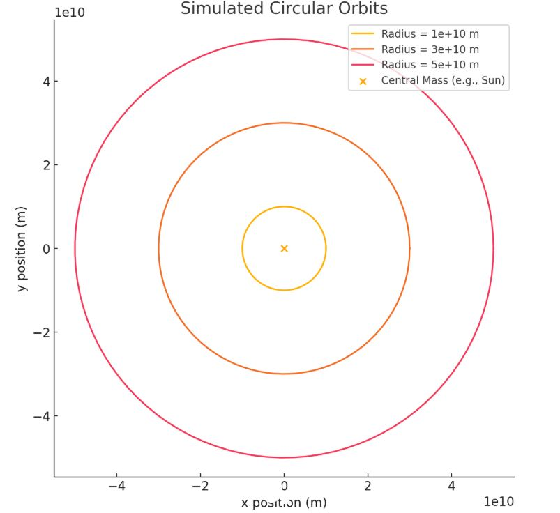
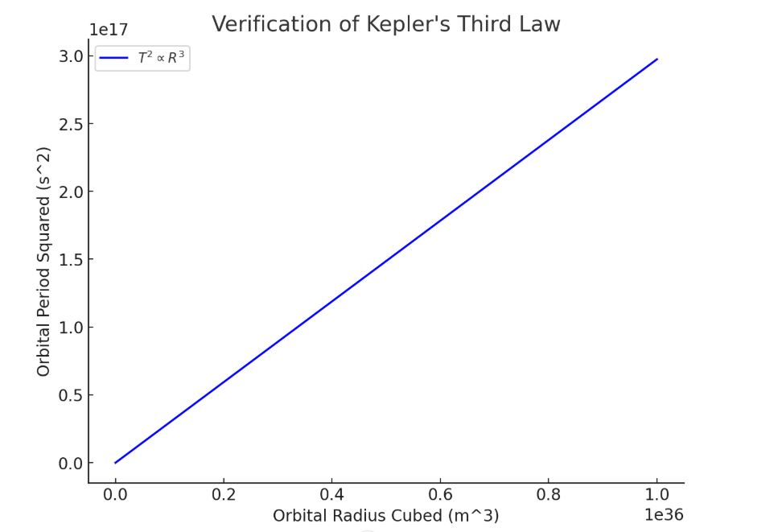
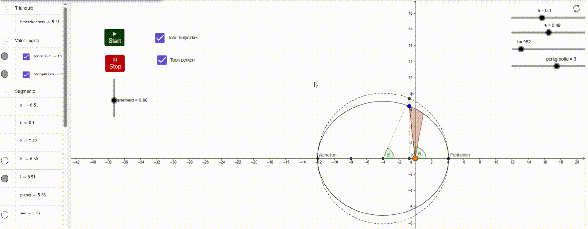

# Problem 1

Orbital Period and Orbital Radius

## 1. Theoretical Foundation

### Establishing Kepler’s Third Law

Kepler’s Third Law articulates that the square of an orbiting body's period \( P \) is directly proportional to the cube of its orbital radius \( r \):

$$
P^2 \propto r^3
$$

For a circular orbit, this can be rigorously derived using Newton’s law of universal gravitation in conjunction with the concept of centripetal force:

1. **Equating Gravitational Force with Centripetal Force:**
    $$
    \frac{GMm}{r^2} = m \frac{v^2}{r}
    $$

    where:
    - \( G \) is the gravitational constant,
    - \( M \) is the mass of the central body,
    - \( m \) is the mass of the orbiting body,
    - \( r \) is the orbital radius,
    - \( v \) is the orbital velocity.

2. **Expressing Orbital Velocity in Terms of Period:**
    The orbital velocity \( v \) is related to the orbital period \( P \) as follows:
    $$
    v = \frac{2 \pi r}{P}
    $$

3. **Deriving Kepler’s Third Law:**
    By substituting \( v \) into the force equation and solving for \( P \), we obtain:
    $$
    P^2 = \frac{4 \pi^2}{GM} r^3
    $$

    This confirms that \( P^2 \propto r^3 \), where the proportionality constant is determined by \( G \) and \( M \).

### Astronomical Significance

-   **Central Body Mass Determination:** Given the period and radius of an orbiting object, the mass of the central body can be calculated.
-   **Orbital Radius Estimation:** If the period of an orbiting body around a central body is known, its orbital radius can be estimated.
-   **Artificial Satellite Design:** Crucial for designing stable orbits for artificial satellites around planets and other celestial bodies.

---
## 2. Practical Illustrations

1.  **Earth's Natural Satellite: The Moon**
    -   The Moon completes its orbit around Earth in approximately \( P = 27.3 \) days.
    -   Its mean orbital radius is approximately \( 3.84 \times 10^5 \) kilometers.
    -   Kepler's relationship can be employed to validate Earth's mass.

2.  **Planetary Orbits within the Solar System**
    -   Kepler's law facilitates comparative analysis of planetary orbits.
    -   For instance, Earth's orbital radius of \( 1 \) astronomical unit (AU) and period of \( 1 \) year aid in estimating the orbital radii of other planets.

---

## 3. Numerical Simulation
The following Python script models circular orbits and validates Kepler's Third Law.

```python
import numpy as np
import matplotlib.pyplot as plt

# Universal Constants
G = 6.67430e-11  # Universal gravitational constant (m^3 kg^-1 s^-2)
M_center = 1.989e30  # Mass of the central body (kg)

# Function to calculate orbital period
def orbital_period(radius, mass=M_center):
    return 2 * np.pi * np.sqrt(radius**3 / (G * mass))

# Data generation
radii = np.logspace(9, 12, 100)  # Orbital radii from 10^9 to 10^12 meters
periods = orbital_period(radii)

# Verification of Kepler's Third Law
T_squared = periods**2
R_cubed = radii**3

# Plot T^2 vs R^3
plt.figure(figsize=(8, 6))
plt.plot(R_cubed, T_squared, label="$T^2 \propto R^3$", color='b')
plt.xlabel("Orbital Radius Cubed (m^3)")
plt.ylabel("Orbital Period Squared (s^2)")
plt.title("Verification of Kepler's Third Law")
plt.legend()
plt.grid()
plt.show()

# Circular orbit simulation
def circular_orbit(radius, num_points=100):
    theta = np.linspace(0, 2 * np.pi, num_points)
    x = radius * np.cos(theta)
    y = radius * np.sin(theta)
    return x, y

# Plot circular orbits for different radii
plt.figure(figsize=(8, 8))
for r in [1e10, 3e10, 5e10]:
    x, y = circular_orbit(r)
    plt.plot(x, y, label=f"Radius = {r:.0e} m")

plt.scatter(0, 0, color='orange', label='Central Mass (e.g., Sun)')
plt.xlabel("x position (m)")
plt.ylabel("y position (m)")
plt.title("Simulated Circular Orbits")
plt.legend()
plt.grid()
plt.axis("equal")
plt.show()
```
This script:
- Calculates orbital periods for varied radii.
- Visualizes \( P^2 \) against \( r^3 \) to validate the linear correlation.




---

## 4. Expansions and Constraints

- **Elliptical Trajectories:** Kepler’s Law remains valid, with \( r \) denoting the semi-major axis.
- **Relativistic Corrections:** Einstein’s theory of relativity adjusts Kepler’s laws in intense gravitational environments.
- **External Disturbances:** Gravitational interactions from other celestial bodies can perturb orbits over extended periods.

---

## 5. Summary

Kepler’s Third Law succinctly connects orbital period and radius, facilitating calculations in celestial mechanics. This relationship remains indispensable in astronomy, satellite design, and space exploration endeavors.

