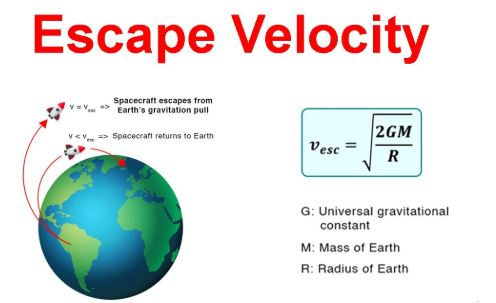

# Problem 2

Escape Velocities and Cosmic Velocities

## 1. Theoretical Foundation

### Defining Cosmic Velocity Thresholds
Cosmic velocities delineate the minimal speeds necessary to achieve distinct modes of motion in space:

1.  **First Cosmic Velocity (Orbital Velocity)**
    -   The minimal velocity required to attain a stable circular trajectory around a celestial body.
    -   Derived from the equilibrium between gravitational attraction and centripetal acceleration:
        $$
        v_1 = \sqrt{\frac{GM}{R}}
        $$

2.  **Second Cosmic Velocity (Escape Velocity)**
    -   The velocity threshold required to overcome a celestial body's gravitational pull without any additional thrust.
    -   Derived from the principle of energy conservation:
        $$
        v_2 = \sqrt{\frac{2GM}{R}}
        $$
    -   It is noteworthy that \( v_2 = \sqrt{2} v_1 \).

3.  **Third Cosmic Velocity (Solar System Ejection Velocity)**
    -   The velocity needed to leave the Sun’s gravitational domain from a planet’s orbital path.
    -   Calculated by combining the escape velocity from the planet and the required velocity to depart the Sun’s gravitational influence:
        $$
        v_3 = \sqrt{v_2^2 + v_{sun}^2}
        $$
    -   where \( v_{sun} \) represents the planet’s orbital velocity around the Sun.

---

## 2. Quantitative Evaluation

-   **Determinants of Velocity Magnitudes:**
    -   **Mass (\( M \))**: Celestial bodies with larger masses necessitate greater velocities.
    -   **Radius (\( R \))**: Smaller celestial bodies demand higher velocities due to increased surface gravitational intensity.
-   **Interrelation of Velocity Metrics:**
    -   Escape velocity consistently surpasses orbital velocity.
    -   The attainment of interstellar travel requires exceeding the third cosmic velocity.

---

## 3. Numerical Simulation
The following Python script computes and graphically represents cosmic velocities for Earth, Mars, and Jupiter.

```python
import numpy as np
import matplotlib.pyplot as plt
from scipy.constants import G

def cosmic_velocity_thresholds(mass, radius):
    """Compute first and second cosmic velocity thresholds."""
    v1 = np.sqrt(G * mass / radius)
    v2 = np.sqrt(2) * v1
    return v1, v2

# Celestial bodies data (mass in kg, radius in m)
celestial_bodies = {
    "Earth": (5.972e24, 6.371e6),
    "Mars": (6.417e23, 3.389e6),
    "Jupiter": (1.898e27, 6.9911e7)
}

velocity_metrics = {body: cosmic_velocity_thresholds(mass, radius) for body, (mass, radius) in celestial_bodies.items()}

# Graphical Representation
body_labels, v1_values, v2_values = zip(*[(body, v[0], v[1]) for body, v in velocity_metrics.items()])
x_positions = np.arange(len(body_labels))
bar_width = 0.35

figure, axis = plt.subplots(figsize=(8, 5))
axis.bar(x_positions - bar_width/2, v1_values, bar_width, label='First Cosmic Velocity (km/s)', color='b')
axis.bar(x_positions + bar_width/2, v2_values, bar_width, label='Second Cosmic Velocity (km/s)', color='r')

axis.set_xticks(x_positions)
axis.set_xticklabels(body_labels)
axis.set_ylabel('Velocity (m/s)')
axis.set_title('First and Second Cosmic Velocity Thresholds')
axis.legend()
plt.grid()
plt.show()
```

This script:
-   Computes orbital and escape velocity thresholds for various celestial bodies.
-   Presents a comparative visualization of these velocity thresholds.


---

## 4. Relevance in Space Exploration

-   **Artificial Satellite Deployment:** The first cosmic velocity is indispensable for establishing stable satellite orbits.
-   **Interplanetary Expeditions:** The escape velocity is a prerequisite for missions to Mars and other celestial bodies.
-   **Interstellar Voyages:** The third cosmic velocity is necessary to exit the Solar System's gravitational influence, as demonstrated by Voyager 1.

---

## 5. Summary

A comprehensive understanding of escape and cosmic velocity thresholds is paramount for space exploration initiatives. These velocity thresholds determine the viability of satellite deployment, interplanetary expeditions, and interstellar voyages.

