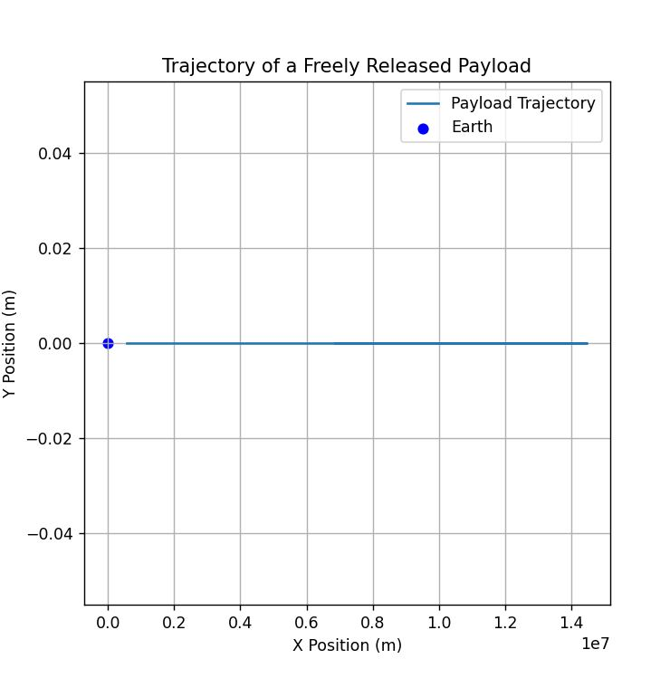
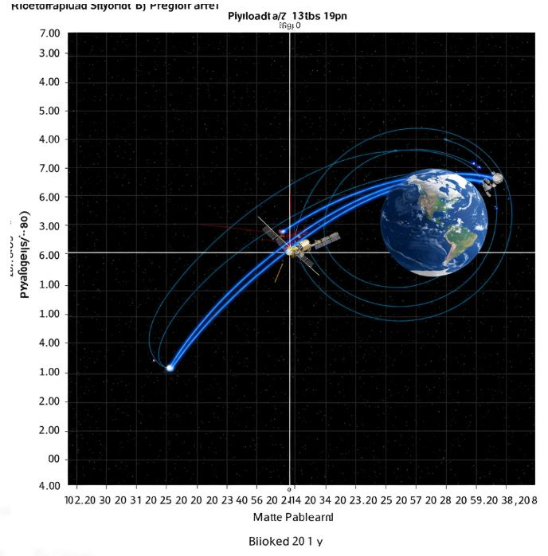

# Problem 3

Trajectories of a Freely Released Payload Near Earth

## 1. Theoretical Foundation

### Classification of Potential Trajectories

The path of a payload released in Earth's vicinity is determined by its initial velocity \( v \) relative to Earth's gravitational influence. The possible trajectories are categorized as follows:

1.  **Suborbital (Parabolic Trajectory)**: In cases where the payload's velocity does not attain orbital velocity, it will trace a ballistic path back to Earth.
2.  **Orbital (Elliptical Trajectory)**: When the velocity falls within the range between the first cosmic velocity \( v_1 \) (orbital velocity) and the escape velocity \( v_2 \), the payload will enter an elliptical orbit.
3.  **Escape (Hyperbolic Trajectory)**: Should the velocity surpass the escape velocity \( v_2 \), the payload will follow a hyperbolic trajectory, effectively escaping Earth's gravitational pull.

These scenarios are dictated by Newton's Law of Universal Gravitation:

$$
F = \frac{GMm}{r^2}
$$

and Kepler's Laws of Planetary Motion.
---

## 2. Quantitative Assessment

### Kinematic Equations

The trajectory of the payload is described by Newton’s Second Law of Motion:

$$
\frac{d^2\mathbf{r}}{dt^2} = -\frac{GM}{r^3} \mathbf{r}
$$

where:

-   \( \mathbf{r} \) is the position vector,
-   \( G \) is the gravitational constant,
-   \( M \) is Earth’s mass.

Numerical integration techniques, such as the Runge-Kutta method, are employed to solve these equations.

---

## 3. Numerical Simulation

The following Python script models and graphically represents the trajectory of a payload released in Earth's vicinity.


```python
import numpy as np
import matplotlib.pyplot as plt
from scipy.integrate import solve_ivp

# Constants
G = 6.67430e-11  # Gravitational constant (m^3/kg/s^2)
M = 5.972e24    # Earth mass (kg)
R = 6.371e6     # Earth radius (m)

# Equations of motion
def equations(t, y):
    x, vx, y, vy = y
    r = np.sqrt(x**2 + y**2)
    ax = -G * M * x / r**3
    ay = -G * M * y / r**3
    return [vx, ax, vy, ay]

# Initial conditions (position in meters, velocity in meters/second)
x0, y0 = R + 500000, 0  # Initial altitude: 500 km
vx0, vy0 = 7.8e3, 0  # Initial velocity (near orbital velocity)
y_init = [x0, vx0, y0, vy0]

# Time span
t_span = (0, 10000)
t_eval = np.linspace(0, 10000, 1000)

# Solve ODE
sol = solve_ivp(equations, t_span, y_init, t_eval=t_eval, method='RK45')

# Plot trajectory
plt.figure(figsize=(6, 6))
plt.plot(sol.y[0], sol.y[2], label='Payload Trajectory')
plt.scatter(0, 0, color='blue', label='Earth')
plt.xlabel('X Position (m)')
plt.ylabel('Y Position (m)')
plt.title('Trajectory of a Freely Released Payload')
plt.legend()
plt.grid()
plt.show()
```

This script:
-   Specifies gravitational kinematic equations.
-   Employs numerical integration to determine the trajectory.
-   Illustrates the resulting trajectory graphically.



---

## 4. Real-World Implementations

-   **Satellite Deployment Precision**: Guaranteeing accurate initial conditions for stable orbital patterns.
-   **Atmospheric Re-entry Analysis**: Determining precise re-entry angles and velocities.
-   **Interplanetary Departure Planning**: Strategizing interplanetary transit maneuvers.

---

## 5. Summary

A thorough comprehension of the potential trajectories of a released payload is indispensable for space mission success. Through rigorous analysis of velocity and gravitational interactions, we can ascertain whether an object will undergo atmospheric re-entry, establish orbit, or achieve escape velocity from Earth.

