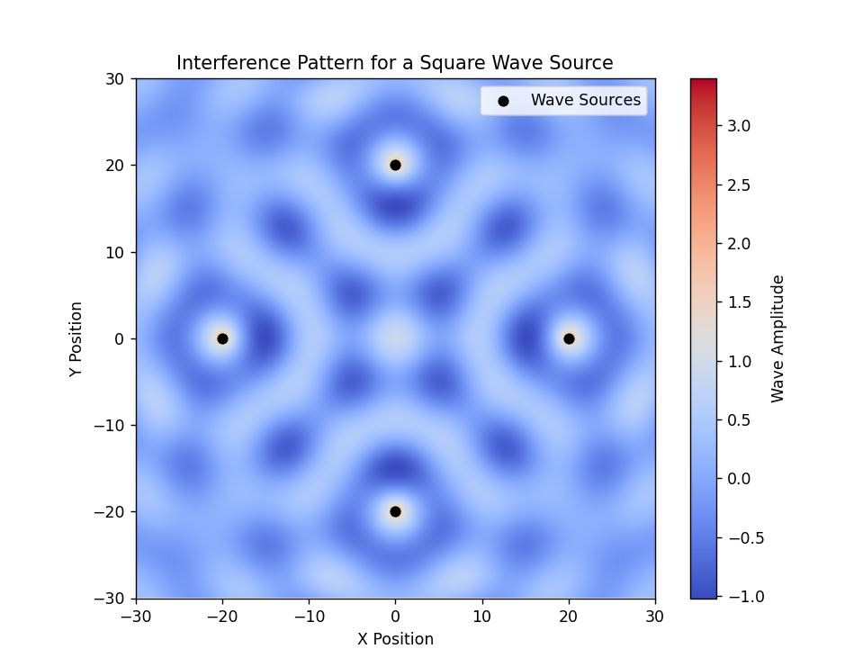
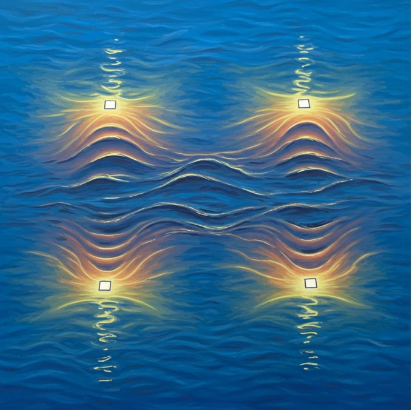

# Problem 1

Interference Patterns on a Water Surface

## 1. Theoretical Background

### Wave Interference

Interference occurs when two or more waves overlap, leading to constructive (amplification) and destructive (cancellation) effects. On a water surface, waves emanating from multiple sources interact to form intricate interference patterns.

The displacement \( \eta(x, y, t) \) of a circular wave originating from a point source \( (x_0, y_0) \) is given by:

\[
\eta(x, y, t) = \frac{A}{\sqrt{r}} \cdot \cos\left(kr - \omega t + \phi\right)
\]

where:

* \( A \) is the wave amplitude,
* \( k = \frac{2\pi}{\lambda} \) is the wave number,
* \( \omega = 2\pi f \) is the angular frequency,
* \( r = \sqrt{(x - x_0)^2 + (y - y_0)^2} \) is the radial distance from the source,
* \( \phi \) is the initial phase.

When multiple sources are present, the net displacement is given by:

\[
\eta_{\text{sum}}(x, y, t) = \sum_{i=1}^{N} \eta_i(x, y, t)
\]

where \( N \) is the number of sources.

## 2. Problem Setup

### 1. Choosing a Regular Polygon

We select a regular polygon (e.g., equilateral triangle, square, pentagon) and place wave sources at its vertices.

### 2. Computing the Superposition

Each vertex of the polygon acts as a wave source, and their combined effect determines the final interference pattern.

## 3. Computational Model

The following Python script simulates and visualizes the interference pattern.

```python
python
import numpy as np
import matplotlib.pyplot as plt

# Define wave parameters
A = 1  # Amplitude
lambda_ = 10  # Wavelength
k = 2 * np.pi / lambda_  # Wave number
omega = 2 * np.pi  # Angular frequency (arbitrary unit)
t = 0  # Time snapshot

# Define polygon vertices (square as an example)
N = 4  # Number of sources (square)
radius = 20  # Distance from center
angles = np.linspace(0, 2 * np.pi, N, endpoint=False)
sources = [(radius * np.cos(a), radius * np.sin(a)) for a in angles]

# Define grid for visualization
x = np.linspace(-30, 30, 300)
y = np.linspace(-30, 30, 300)
X, Y = np.meshgrid(x, y)

# Compute wave interference pattern
eta_sum = np.zeros_like(X)
for x0, y0 in sources:
    R = np.sqrt((X - x0)**2 + (Y - y0)**2)
    eta_sum += A / np.sqrt(R + 1e-6) * np.cos(k * R - omega * t)  # Avoid division by zero

# Plot the interference pattern
plt.figure(figsize=(8, 6))
plt.imshow(eta_sum, extent=[-30, 30, -30, 30], cmap='coolwarm', origin='lower')
plt.colorbar(label='Wave Amplitude')
plt.scatter(*zip(*sources), color='black', label='Wave Sources')
plt.legend()
plt.title('Interference Pattern for a Square Wave Source')
plt.xlabel('X Position')
plt.ylabel('Y Position')
plt.show()
```



---

## 4. Observations and Analysis

1.  **Reinforced Waves**: Luminous areas point to where wave peaks amplify each other.
2.  **Cancelled Waves**: Dim areas indicate suppression due to phase variations.
3.  **Geometric Symmetry**: The pattern mirrors the geometry of the selected polygon.

---

## 5. Conclusion

This experiment shows how waves from several points combine to create interference effects. By changing the polygon's form and wave characteristics, we can examine diverse wave actions applicable in sound, light, and fluid motion.

