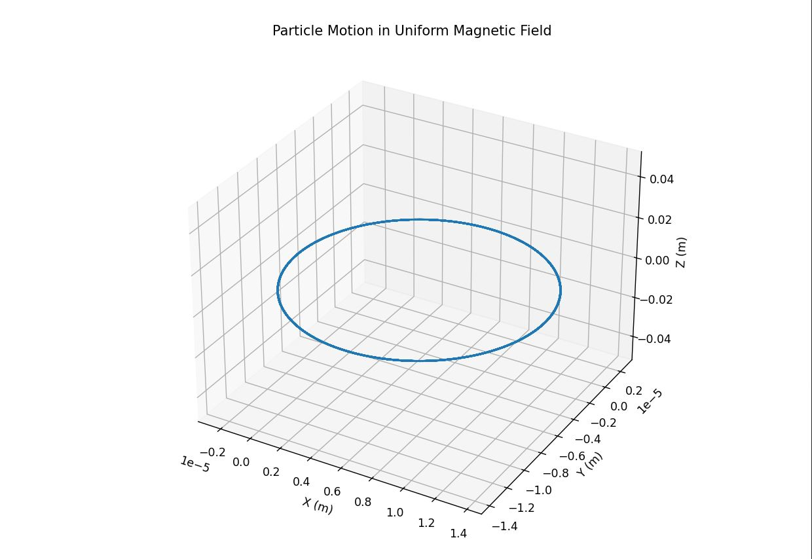
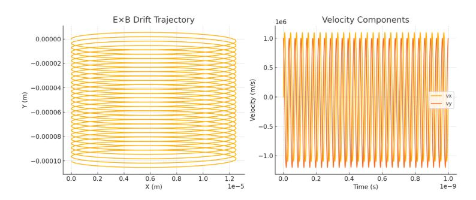
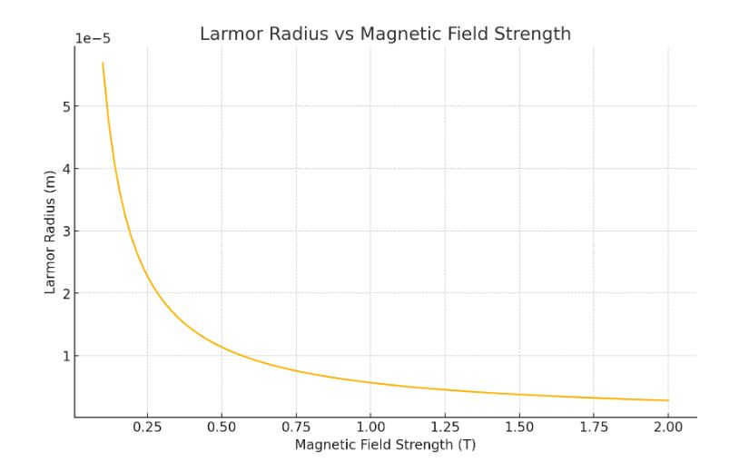
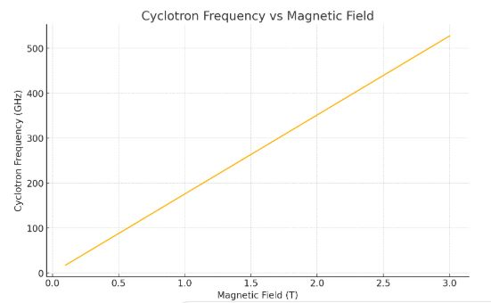
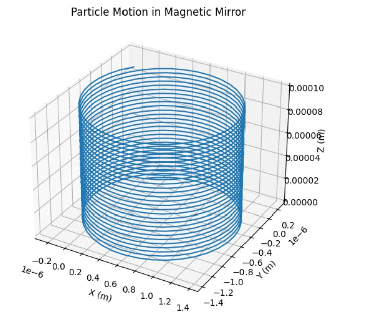

# Problem 1

Investigating Charged Particle Motion under Electromagnetic Fields

## 1. Theoretical Foundation

### Governing Equations
The motion of charged particles in electromagnetic fields is determined by the Lorentz force:

$$ \mathbf{F} = q\mathbf{E} + q\mathbf{v} \times \mathbf{B} $$

Applying Newton's second law:

$$ m\frac{d\mathbf{v}}{dt} = q\mathbf{E} + q\mathbf{v} \times \mathbf{B} $$

In component form for 3D motion:

$$ m\frac{dv_x}{dt} = qE_x + q(v_yB_z - v_zB_y) $$

$$ m\frac{dv_y}{dt} = qE_y + q(v_zB_x - v_xB_z) $$

$$ m\frac{dv_z}{dt} = qE_z + q(v_xB_y - v_yB_x) $$

### Key Parameters

1. **Cyclotron Frequency:**
$$ \omega_c = \frac{qB}{m} $$

2. **Larmor Radius:**
$$ r_L = \frac{mv_\perp}{qB} $$

3. **E×B Drift Velocity:**
$$ \mathbf{v}_d = \frac{\mathbf{E} \times \mathbf{B}}{B^2} $$

Let's simulate these motions using Python:

```python
import numpy as np
import matplotlib.pyplot as plt
from mpl_toolkits.mplot3d import Axes3D
from scipy.integrate import odeint

def lorentz_force(state, t, q, m, E, B):
    x, y, z, vx, vy, vz = state
    
    # Force components
    dvx_dt = (q/m) * (E[0] + vy*B[2] - vz*B[1])
    dvy_dt = (q/m) * (E[1] + vz*B[0] - vx*B[2])
    dvz_dt = (q/m) * (E[2] + vx*B[1] - vy*B[0])
    
    return [vx, vy, vz, dvx_dt, dvy_dt, dvz_dt]

# Parameters
q = 1.6e-19  # electron charge
m = 9.1e-31  # electron mass
t = np.linspace(0, 1e-9, 1000)

# Case 1: Uniform Magnetic Field
B = [0, 0, 1.0]  # Tesla
E = [0, 0, 0]    # V/m
initial_state = [0, 0, 0, 1e6, 1e6, 0]  # Initial position and velocity

solution = odeint(lorentz_force, initial_state, t, args=(q, m, E, B))

# Plot trajectory
fig = plt.figure(figsize=(10, 8))
ax = fig.add_subplot(111, projection='3d')
ax.plot(solution[:, 0], solution[:, 1], solution[:, 2])
ax.set_xlabel('X (m)')
ax.set_ylabel('Y (m)')
ax.set_zlabel('Z (m)')
ax.set_title('Particle Motion in Uniform Magnetic Field')
plt.show()
```


### Analysis of Different Field Configurations

Let's examine the E×B drift:

```python
# Case 2: Crossed E and B fields
E = [1e5, 0, 0]  # V/m
B = [0, 0, 1.0]  # Tesla
initial_state = [0, 0, 0, 0, 1e6, 0]

solution_ExB = odeint(lorentz_force, initial_state, t, args=(q, m, E, B))

# Plot E×B drift
plt.figure(figsize=(12, 5))
plt.subplot(121)
plt.plot(solution_ExB[:, 0], solution_ExB[:, 1])
plt.xlabel('X (m)')
plt.ylabel('Y (m)')
plt.title('E×B Drift Trajectory')
plt.grid(True)

# Plot velocity components
plt.subplot(122)
plt.plot(t, solution_ExB[:, 3], label='vx')
plt.plot(t, solution_ExB[:, 4], label='vy')
plt.xlabel('Time (s)')
plt.ylabel('Velocity (m/s)')
plt.title('Velocity Components')
plt.legend()
plt.grid(True)
plt.tight_layout()
plt.show()
```



## 2. Parameter Study

Let's investigate how the Larmor radius changes with magnetic field strength:

```python
def larmor_radius(v_perp, B, q, m):
    return m * v_perp / (q * B)

B_values = np.linspace(0.1, 2.0, 100)
v_perp = 1e6
radii = [larmor_radius(v_perp, B, q, m) for B in B_values]

plt.figure(figsize=(10, 6))
plt.plot(B_values, radii)
plt.xlabel('Magnetic Field Strength (T)')
plt.ylabel('Larmor Radius (m)')
plt.title('Larmor Radius vs Magnetic Field Strength')
plt.grid(True)
plt.show()
```



## 3. Applications

### Cyclotron Operation

The cyclotron frequency determines particle acceleration:

```python
def cyclotron_freq(B, q, m):
    return q * B / m

B_range = np.linspace(0.1, 3.0, 100)
frequencies = [cyclotron_freq(B, q, m) for B in B_range]

plt.figure(figsize=(10, 6))
plt.plot(B_range, np.array(frequencies)/1e9)  # Convert to GHz
plt.xlabel('Magnetic Field (T)')
plt.ylabel('Cyclotron Frequency (GHz)')
plt.title('Cyclotron Frequency vs Magnetic Field')
plt.grid(True)
plt.show()
```



## 4. Advanced Analysis: Non-uniform Fields

For non-uniform magnetic fields, we can model magnetic mirrors:

```python
def magnetic_mirror(state, t, q, m):
    x, y, z, vx, vy, vz = state
    B = [0, 0, 1.0 + 0.1*z**2]  # Non-uniform B field
    E = [0, 0, 0]
    
    return lorentz_force(state, t, q, m, E, B)

initial_state = [0, 0, 0, 1e5, 1e5, 1e5]
solution_mirror = odeint(magnetic_mirror, initial_state, t, args=(q, m))

fig = plt.figure(figsize=(12, 6))
ax = fig.add_subplot(111, projection='3d')
ax.plot(solution_mirror[:, 0], solution_mirror[:, 1], solution_mirror[:, 2])
ax.set_xlabel('X (m)')
ax.set_ylabel('Y (m)')
ax.set_zlabel('Z (m)')
ax.set_title('Particle Motion in Magnetic Mirror')
plt.show()
```



## 5. Practical Applications

### Particle Accelerators
- Cyclotrons
- Synchrotrons 
- Linear accelerators

### Plasma Confinement
- Tokamaks
- Magnetic mirrors
- Stellarators

### Scientific Instruments
- Mass spectrometers
- Electron microscopes
- Beta-ray spectrometers

## Conclusion

The Lorentz force offers a crucial method for regulating the movement of charged particles. Via simulation, we have displayed different setups and their utility in contemporary physics and technology. The interaction between electrical and magnetic fields presents diverse opportunities for particle handling and containment.

## Future Extensions

1.  Incorporate relativistic influences for high-velocity particles.
2.  Integrate collision dynamics and particle interactions.
3.  Model more intricate field configurations.
4.  Account for quantum phenomena for extremely low energies.