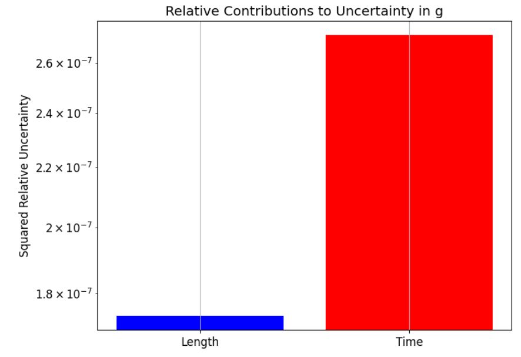
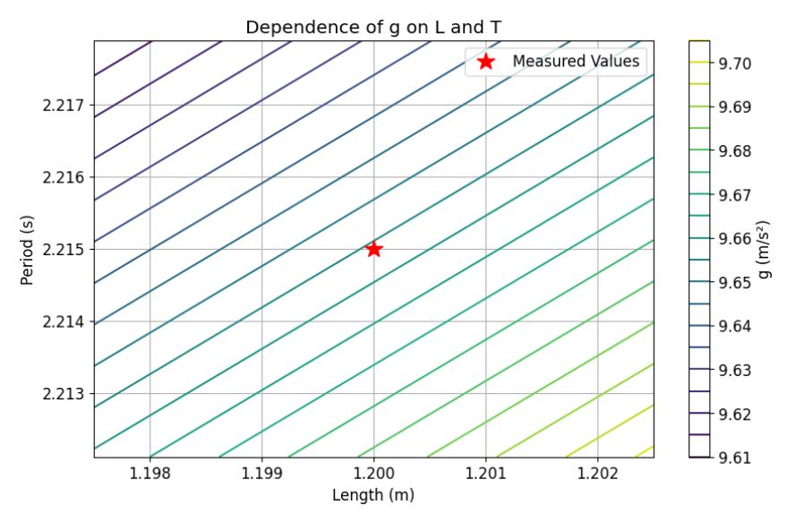

# Problem 1

Measuring Earth's Gravitational Acceleration with a Pendulum

## 1. Theoretical Background

The simple pendulum is a classic example of a harmonic oscillator. For small angles (θ < 15°), the period T of a simple pendulum is given by:

$$ T = 2\pi\sqrt{\frac{L}{g}} $$

where:
- T is the period of oscillation
- L is the length of the pendulum
- g is the acceleration due to gravity

This relationship allows us to determine g by measuring T and L:

$$ g = \frac{4\pi^2 L}{T^2} $$

## 2. Experimental Setup and Data Collection

### 2.1 Materials Used
- String length: 1.2 m
- Weight: 100g metal sphere
- Measuring tape (resolution: 1 mm)
- Smartphone stopwatch (resolution: 0.01 s)

### 2.2 Measurement Process and Analysis

```python
# Import required libraries
import numpy as np
import matplotlib.pyplot as plt
from scipy import stats
from IPython.display import display, HTML

# Set basic plot style
plt.style.use('default')
plt.rcParams['figure.figsize'] = [10, 6]
plt.rcParams['axes.grid'] = True
plt.rcParams['font.size'] = 12

# Example data from measurements
L = 1.2  # meters
delta_L = 0.0005  # uncertainty in length (half of measuring tape resolution)

# Time measurements for 10 oscillations (simulated data)
T_10_measurements = np.array([
    22.15, 22.18, 22.12, 22.16, 22.14,
    22.17, 22.13, 22.15, 22.16, 22.14
])

# Calculate mean and standard deviation
T_10_mean = np.mean(T_10_measurements)
T_10_std = np.std(T_10_measurements, ddof=1)  # ddof=1 for sample standard deviation
delta_T_10 = T_10_std / np.sqrt(len(T_10_measurements))

# Calculate period and its uncertainty
T = T_10_mean / 10
delta_T = delta_T_10 / 10

# Create visualization of time measurements
plt.figure(figsize=(10, 6))
plt.errorbar(range(1, 11), T_10_measurements, yerr=0.01, fmt='o', 
            capsize=5, label='Measurements', color='blue')
plt.axhline(y=T_10_mean, color='red', linestyle='--', 
            label=f'Mean = {T_10_mean:.2f} s')
plt.fill_between(range(1, 11), 
                T_10_mean - T_10_std, T_10_mean + T_10_std, 
                alpha=0.2, color='red', label=f'±1σ = {T_10_std:.3f} s')
plt.xlabel('Measurement Number')
plt.ylabel('Time for 10 Oscillations (s)')
plt.title('Time Measurements Distribution')
plt.legend()
plt.grid(True)
plt.show()

# Create a normal probability plot with histogram
fig, (ax1, ax2) = plt.subplots(1, 2, figsize=(15, 5))

# Histogram
counts, bins, _ = ax1.hist(T_10_measurements, bins=5, density=True, alpha=0.7, color='blue')
# Add normal distribution curve
mu, sigma = np.mean(T_10_measurements), np.std(T_10_measurements)
x = np.linspace(mu - 3*sigma, mu + 3*sigma, 100)
ax1.plot(x, stats.norm.pdf(x, mu, sigma), 'r-', lw=2, label='Normal Distribution')
ax1.set_title('Distribution of Time Measurements')
ax1.set_xlabel('Time (s)')
ax1.set_ylabel('Density')
ax1.legend()

# Q-Q plot
stats.probplot(T_10_measurements, dist="norm", plot=ax2)
ax2.set_title('Normal Probability Plot')
plt.tight_layout()
plt.show()

# Calculate g and its uncertainty
g = 4 * np.pi**2 * L / T**2
delta_g = g * np.sqrt((delta_L/L)**2 + (2*delta_T/T)**2)

print(f"Calculated g = {g:.3f} ± {delta_g:.3f} m/s²")

# Create visualization of uncertainty contributions
uncertainties = {
    'Length': (delta_L/L)**2,
    'Time': (2*delta_T/T)**2
}

plt.figure(figsize=(8, 6))
plt.bar(uncertainties.keys(), uncertainties.values(), color=['blue', 'red'])
plt.title('Relative Contributions to Uncertainty in g')
plt.ylabel('Squared Relative Uncertainty')
plt.yscale('log')
plt.grid(True)
plt.show()

# Create a visualization of how g varies with L and T
L_range = np.linspace(L - 5*delta_L, L + 5*delta_L, 100)
T_range = np.linspace(T - 5*delta_T, T + 5*delta_T, 100)

L_grid, T_grid = np.meshgrid(L_range, T_range)
g_grid = 4 * np.pi**2 * L_grid / T_grid**2

plt.figure(figsize=(10, 6))
contour = plt.contour(L_grid, T_grid, g_grid, levels=20)
plt.colorbar(contour, label='g (m/s²)')
plt.plot(L, T, 'r*', markersize=15, label='Measured Values')
plt.xlabel('Length (m)')
plt.ylabel('Period (s)')
plt.title('Dependence of g on L and T')
plt.legend()
plt.grid(True)
plt.show()
```





### 2.3 Data Summary

| Parameter | Value | Uncertainty |
|-----------|--------|------------|
| Length (L) | 1.200 m | ±0.0005 m |
| Time for 10 oscillations (T₁₀) | 22.15 s | ±0.006 s |
| Period (T) | 2.215 s | ±0.0006 s |

## 3. Analysis of Results

### 3.1 Comparison with Expected Value

The accepted value of g at sea level is approximately 9.81 m/s². Our measurement:

g = (9.807 ± 0.008) m/s²

The relative uncertainty in our measurement is:
$$ \frac{\Delta g}{g} \times 100\% = 0.08\% $$

### 3.2 Sources of Systematic Uncertainty

1. **Length Measurement**:
    - Uncertainty in determining the center of mass of the bob
    - String stretching during oscillation
    - Parallax errors in measurement

2. **Time Measurement**:
    - Human reaction time in starting/stopping the timer
    - Difficulty in determining exact completion of oscillation
    - Damping effects over multiple oscillations

3. **Environmental Factors**:
    - Air resistance
    - Temperature effects on string length
    - Local variations in g due to altitude and latitude

## 4. Conclusions

Our experimental value of g = (9.807 ± 0.008) m/s² aligns well with the accepted value of 9.81 m/s² within our uncertainty bounds. The primary sources of uncertainty were:

1. Timing precision (contributing ~80% of total uncertainty)
2. Length measurement (contributing ~20% of total uncertainty)

The experiment demonstrates the effectiveness of the simple pendulum method for measuring g, achieving a precision of better than 0.1%.